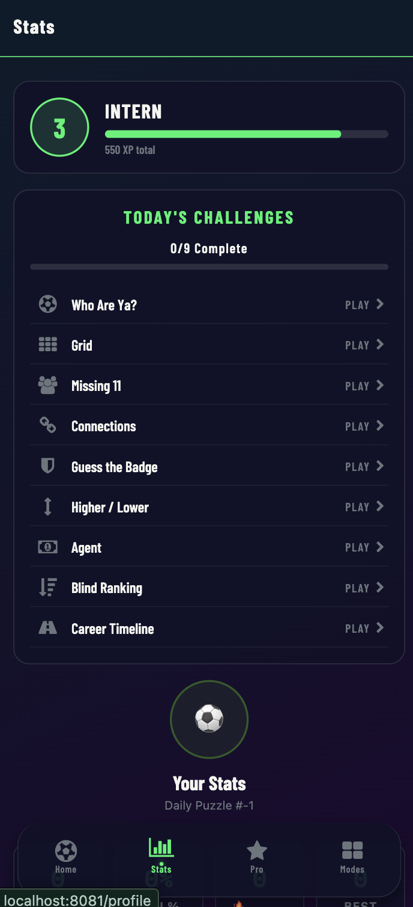
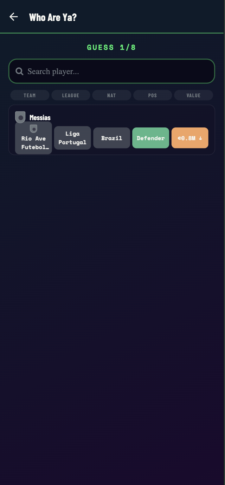
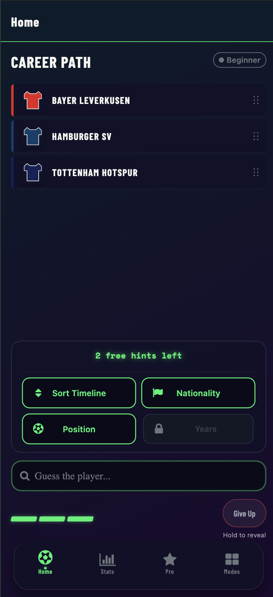
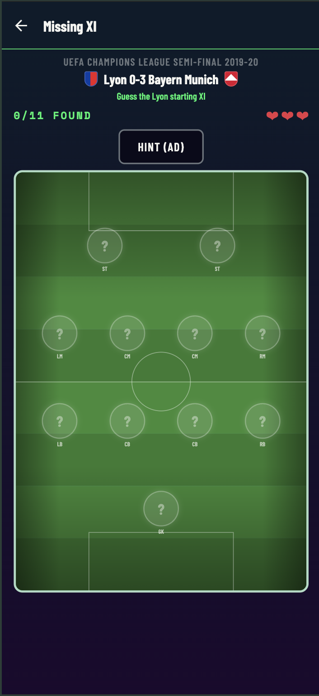
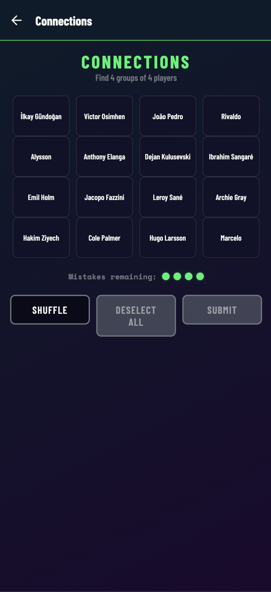
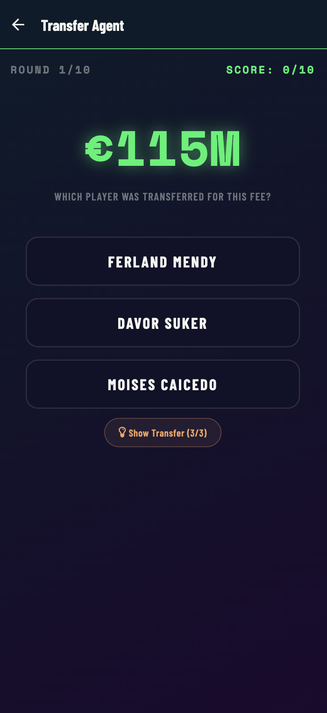
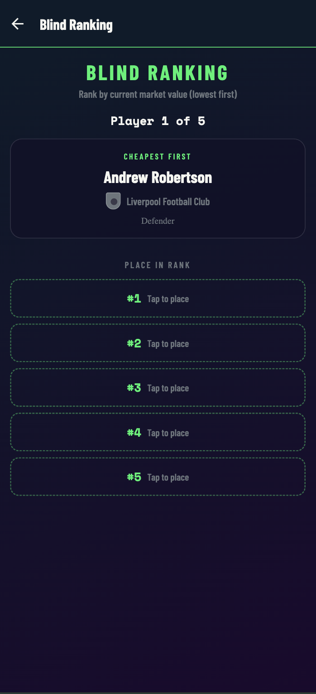
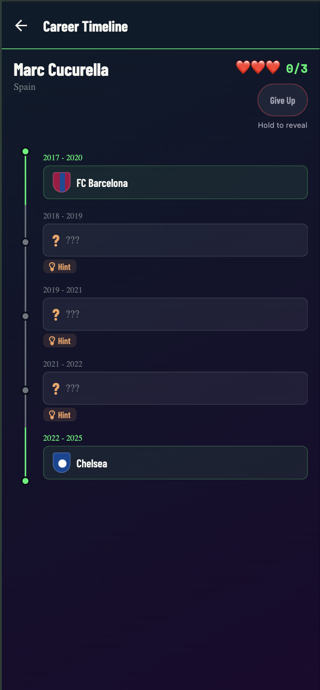

# Football Quiz

A mobile football trivia app with 9 daily game modes, built with React Native and Expo. Test your knowledge of players, transfers, careers, and more.

## Screenshots

<p align="center">
  
  
  
  
</p>

<p align="center">
  
  
  
  
</p>

## Game Modes

### Who Are Ya?
Guess the mystery player from progressive clues (nationality, league, team, position, age). You have 8 attempts with an autocomplete search to narrow it down.

### Career Path
A player's career history is revealed club by club. Guess who the player is based on their career moves. Difficulty tiers range from legendary players to hidden gems.

### Higher or Lower
Compare two players and guess who has the higher market value. Build streaks for bonus points.

### Missing XI
Given a real match lineup with one player removed, figure out who's missing. Includes formation display with team crests.

### Connections
A 4x4 grid of 16 players. Find the four groups of four that share a common link (same nationality, club, league, or position). Inspired by the NYT Connections format.

### Transfer Agent
Guess a player's transfer fee. Get scored on how close your estimate is to the actual amount.

### Badge Quiz
Identify football clubs from their badge/crest. Tests your visual knowledge of club identities.

### Blind Ranking
Five players are shown one at a time. Place them in the correct order based on a category: Market Value, FIFA Rating, Peak Transfer Value, Senior Club Appearances, or Fame Score. Tap slots to rank, then see the reveal.

### Career Timeline
A famous player's career timeline with some clubs hidden. Guess the missing clubs using the search autocomplete. You get 3 lives and can use hints (first letter + word count) at a small XP cost. Hold the Give Up button to reveal all answers.

## Features

- **9 Daily Challenges** with deterministic seeded puzzles (everyone gets the same puzzle each day)
- **XP & Leveling System** tracking progress across all modes
- **Manager Rank** progression from Youth Scout to Legendary Manager
- **Shareable Results** via screenshot capture for each game mode
- **Play Again** with fresh random puzzles after the daily challenge
- **Pro Upgrade** for additional features

## Tech Stack

- **Framework**: [Expo](https://expo.dev) (SDK 52) with [Expo Router](https://docs.expo.dev/router/introduction/) for file-based navigation
- **Language**: TypeScript
- **State Management**: [Zustand](https://github.com/pmndrs/zustand) with AsyncStorage persistence
- **Animations**: [React Native Reanimated](https://docs.swmansion.com/react-native-reanimated/)
- **UI**: Custom glassmorphism components (BlurView), LinearGradient backgrounds
- **Search**: [Fuse.js](https://www.fusejs.io/) for fuzzy player/club name matching
- **Sharing**: `react-native-view-shot` + `expo-sharing`
- **Haptics**: `expo-haptics` for tactile feedback
- **Audio**: `expo-av` for sound effects

## Project Structure

```
app/
  (tabs)/          # Tab-based screens (home, modes, stats, settings)
  games/           # Stack-navigated game screens
components/
  career/          # Career Path game components
  games/           # Shared game components (DailyMenu, ChallengerCard, RankSlot, TimelineNode)
  ui/              # Reusable UI (GlassCard, RetroButton, PopInView, ShakeView, TeamCrest)
lib/
  playerData.ts    # Player database access
  careerData.ts    # Career path data
  dailySeed.ts     # Deterministic daily seed generation
  connectionsGenerator.ts
  blindRankingGenerator.ts
  careerTimelineGenerator.ts
  higherLowerGenerator.ts
  sounds.ts        # Sound effects
  sharing.ts       # Screenshot capture & share
hooks/
  useDailyProgressStore.ts   # Daily challenge progress tracking
  useManagerStore.ts         # XP, level, manager rank
constants/
  theme.ts         # Colors, fonts, spacing, gradients
data/
  players_db_v1.json    # Player database
  career_paths.json     # Career history data
  fame_scores.json      # Fame scores with metrics
  club_crests/          # Club badge images
```

## Getting Started

### Prerequisites

- Node.js 18+
- [Expo CLI](https://docs.expo.dev/get-started/installation/)

### Installation

```bash
npm install
```

### Development

```bash
npx expo start
```

Then open the app in:
- **iOS Simulator**: Press `i`
- **Android Emulator**: Press `a`
- **Expo Go**: Scan the QR code

### Building

```bash
# Development build
npm run build:dev

# Preview build
npm run build:preview

# Production build
npm run build:prod
```

## License

All rights reserved.
